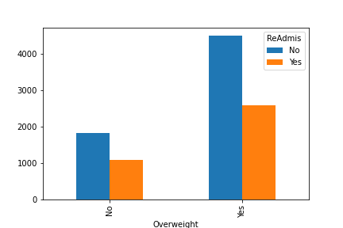

D207: Exploratory Data Analysis
---

# Goal

Our primary focus will be on the question of whether or not a patient being overweight contributes to their chance of Readmission. If we can identify obesity as a corollary to readmission then healthcare providers will know to pay special attention to overweight patients in order to lower readmission rates.

The code for this analysis can be found in the notebook ``data-analysis.ipynb``

# Chi-square analysis
We'll use chi-square analysis to see if there is a statistically significant correlation between being overweight and readmission. 

## Hypothesis


Our Hypothesis is that a patient being overweight is statistically significant to the outcome of being readmitted. Our null hypothesis is that it does not.

## Experiment

First we transform the data to make the chi-square process easier.

```python
df['overweight_re'] = (df['Overweight']=='Yes') & (df['ReAdmis']=='Yes')
df['not_overweight_re'] = (df['Overweight']=='No') & (df['ReAdmis']=='Yes')
df['readmission_by_overweight'] = np.where(df['overweight_re']==True,'Overweight',
                    np.where(df['not_overweight_re']==True,'Not',None))
```
Now we run the chi-square analysis. 
```python
obs = df['readmission_by_overweight'].value_counts()
chi_square = stats.chisquare(obs)
```

## Outcome
Now we will see if out outcome is statistically significant. We pick an alpha level of 5% to determine if there is statistical significance.

```
print(chi_square[1] < 0.05)
```
Output:
> True

This indicates that there is a statistically significant difference in readmission between overweight and not overweight patients. Therefore, it is recommended that extra attention and care be given to Overweight patients in order to reduce readmission. 

### Limitations

Being overweight is but one aspect of a patient. While giving extra attention to overweight patients may reduce readmission, there are other pre-existing conditions that should be looked at as well in order to more fully solve the problem. 

# Univariate Analysis

## Categorical variables

We'll look at the categorical variables ``ReAdmis`` and ``Overweight``.

### ReAdmis


### Overweight


## Continuous Variables

We'll examine the continuous variables ``Population`` and ``Income``

### Population


### Income


# Bivariate Analysis

## Categorical Variables

We'll examine the categorical variables ``Overweight`` and ``ReAdmis``.


## Continuous Variables

We'll examine the continuous variables ``Age`` and ``Initial_days``.
